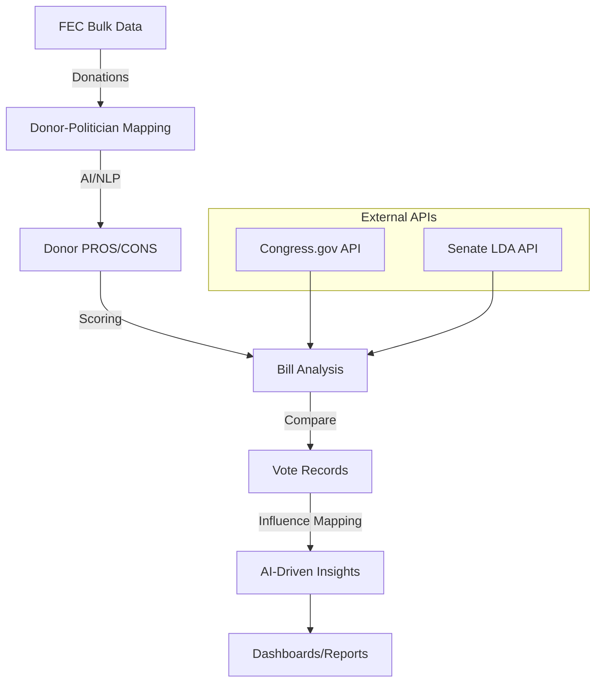
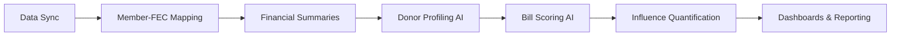

# Legal Tender: AI-Driven Political Influence Analysis

**Follow the money. Map the influence. Expose the connections.**

Legal Tender is an AI-powered pipeline to analyze the influence of money in US politics. We connect campaign finance data, donor profiles, bill analysis, and voting records to answer:

> **Does money influence how politicians vote?**

Our mission is to:
- Trace the flow of money from donors to politicians
- Use AI to profile donor interests and generate PROS/CONS
- Score bills and votes against donor preferences
- Quantify and visualize the influence of money on US legislation

---

## System Architecture

---

## Data Sources

We pull data from multiple authoritative government sources and aggregate them into a unified MongoDB database.

### Current Sources (Implemented)

#### 1. **FEC Bulk Data** (`https://www.fec.gov/files/bulk-downloads`)

FEC publishes pipe-delimited bulk files for each 2-year election cycle. We currently process **4 cycles**: 2020, 2022, 2024, 2026.

| File | Name | Size | Purpose |
|------|------|------|---------|
| `cn.zip` | Candidate Master | ~2 MB | All federal candidates (ID, name, party, office, state, district) |
| `cm.zip` | Committee Master | ~1 MB | All committees (PACs, Super PACs, candidate committees) |
| `ccl.zip` | Candidate-Committee Linkages | ~1 MB | Maps candidates to their authorized committees |
| `webl.zip` | Committee Summaries | ~7 MB | Aggregate financial summaries by committee |
| `pas2.zip` | Committee Contributions | ~300 MB | Committee-to-committee transfers (used for financial summaries) |

**Currently downloading**: `cn`, `cm`, `ccl`, `pas2` for cycles 2020-2026

#### 2. **Congress Legislators** (`https://unitedstates.github.io/congress-legislators/`)

The `legislators-current.yaml` file from the `@unitedstates` project provides structured data for all current members of Congress, including:
- Biographical info (name, birthday, gender)
- Terms (start/end dates, state, district, party)
- IDs (bioguide_id, govtrack_id, fec_ids)

#### 3. **Congress.gov API** (Planned - Phase 5)

For bill text, summaries, and legislative actions to enable AI-powered bill analysis.

#### 4. **Senate LDA API** (`https://lda.senate.gov/api/v1/`) (Planned - Phase 6)

For lobbying disclosure data to map corporate influence alongside individual donors.

### Future Sources (Planned)

| File | Name | Size | Purpose | Phase |
|------|------|------|---------|-------|
| `indiv.zip` | Individual Contributions | ~2-4 GB | Itemized donations from individuals to committees | Phase 4 |
| `oppexp.zip` | Independent Expenditures | ~2-3 GB | Outside spending (Super PACs, dark money) | Phase 6 |
| `weball.zip` | Candidate Summaries | ~7 MB | Aggregate financial summaries by candidate | Phase 3 |
| Congress.gov API | Bills & Votes | Variable | Bill text, summaries, votes for scoring against donor interests | Phase 5 |
| Senate LDA API | Lobbying Filings | Variable | Corporate lobbying disclosures | Phase 6 |

---

## Current Progress (as of October 2025)

- Data pipeline operational for 4 election cycles (FEC bulk data: 2020, 2022, 2024, 2026)
- Downloading and processing: `cn`, `cm`, `ccl`, `pas2` files (~300MB per cycle)
- Deduplication and per-cycle/career aggregation implemented
- Hierarchical MongoDB schema for members, donors, and transactions
- Modular asset-based data sync (downloads, mapping, summaries)
- Smart caching with `Last-Modified` header checks to avoid redundant downloads
- Early AI/NLP bill analysis pipeline in development
- All legacy/test files and docs removed; codebase cleaned for main branch

---

## Roadmap: 6 Phases to Full Influence Analysis

1. **Data Sync**: Download and update FEC, Congress, and LDA data
2. **Member-FEC Mapping**: Link politicians to FEC records
3. **Financial Summaries**: Aggregate donations per cycle and career
4. **Donor Profiling (AI)**: Use LLMs to generate donor PROS/CONS
5. **Bill Scoring (AI)**: Score bills against donor preferences
6. **Influence Quantification**: Map money to votes, visualize influence

---

## Future Goals

- Complete AI/NLP pipeline for donor and bill profiling
- Launch dashboards for public and researcher access
- Expand to include lobbying, PACs, and outside spending
- Publish open-source datasets and analysis tools
- Collaborate with civic tech and transparency orgs

---

## Contributing & Contact

We welcome contributors passionate about transparency and AI for good. See `src/` for code structure. For questions or collaboration, open an issue or contact the maintainer.
