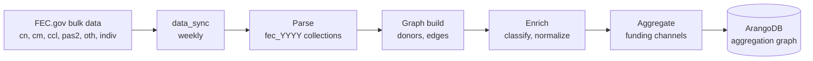

# Legal Tender

**Trace political money from source to candidate.**

> **Rewrite status:** The Python + Dagster + ArangoDB system below is the
> legacy implementation and validation source. A fresh Go data plane with a
> minimal Python Dagster control plane is underway. The coordinated FEC source
> release, immutable Schedule A occurrence/change layer, and normalized facts
> for the five classic candidate/committee/linkage/summary products are
> implemented. The complete 2024 direct receipt calculation and full-grain
> Schedule A Parquet publication and compact occurrence/change evidence have
> passed their corpus gates. Compact calculation membership and candidate
> results now also pass exact complete-corpus equivalence. An immutable
> same-release fact bundle and exact Dagster partition mappings now automate
> that calculation without changing its result. The isolated Go-only ArangoDB
> projection then passed its complete 2024 import, query, and idempotent replay
> gates without copying raw receipt rows into the graph. Processed Schedule E
> is now published losslessly for all four target cycles, and the accepted Go
> calculation conserves exact signed support/opposition spending into immutable
> results and sparse exceptions. The isolated outside-spending projection now
> also passes its complete 2024 import, exact readback, graph-query, and replay
> gates. Its immutable same-release readiness bundle and eager Dagster mapping
> are also implemented; the unchanged resolved method and graph now pass all
> four target cycles. The 2024 receiver-reported committee-flow graph also
> passes exact readback, path, and cycle gates. Its 707 missing same-cycle
> committee masters are classified: 675 have official historical registration
> evidence and 32 remain unresolved reported IDs. An additive immutable
> identity calculation and v2 ArangoDB graph now expose those states, preserve
> all money, and exclude all 707 from terminal-source stopping. The v1 Dagster
> chain remains unchanged. Processed Schedule B now has a complete artifact,
> strict 157.5-million-row 2024 parser gate, and exact classic direction and
> amount comparison. The immutable 2026-08-30 Schedule A/B alignment gate also
> passes with exact conservation and no money merge. Active coordinated
> release v3 now owns Schedule B. Its lossless 98-column selected-cycle
> Parquet publisher, minimal Dagster asset, and complete 157,544,163-row 2024
> corpus gate pass with 158 verified shards and byte-identical replay. Effective
> disbursement, outgoing-flow, reconciliation, and graph policy remain later
> versioned layers.
> Start with the
> [redesign index](docs/design/README.md) for target behavior and the
> [Go as-built ledger](docs/go-rewrite.md) for code that exists now.

Legal Tender builds a graph database of U.S. federal campaign finance and answers questions like:

> *"Who actually funded this candidate? Through how many PACs? How much came from corporate employees vs. individuals vs. independent expenditures vs. unitemized?"*

```
DONOR → PAC → PAC → PAC → CANDIDATE
  └─────────── trace the full path ───────────┘
```

The pipeline ingests FEC bulk data, builds a money-flow graph in ArangoDB, and computes per-candidate funding breakdowns via a multi-hop trace algorithm.

## Legacy product surface

For every federal candidate, per cycle and aggregated, a five-channel funding breakdown:

| Channel | Captures |
|---|---|
| **Organizational Direct** | Corporate, trade, labor, ideological, and cooperative PAC money — traced through any number of passthrough committees back to the terminal source organization. |
| **IE Support** | Independent expenditures FOR the candidate by Super PACs and others, traced upstream to who funded those Super PACs. |
| **IE Oppose** | Independent expenditures AGAINST the candidate (same trace). |
| **Individuals** | Itemized donations split into *whale* (per-election max-out donors, with employer/corporate detail) and *grassroots* (sub-limit, known totals from raw FEC). |
| **Unaccounted** | True residual: unitemized <$200 donors, deep trace loss, data gaps. Typically 3-5%. |

Each channel breaks down further by organization, so you can answer *"how much money traceable to Goldman Sachs reached this candidate, in what form?"* — corporate PAC, employee donations, IE support, or a combination.

## Legacy architecture


```mermaid
flowchart LR
    FEC[FEC.gov bulk data<br/>cn, cm, ccl, pas2, oth, indiv] --> SYNC[data_sync<br/>weekly]
    SYNC --> PARSE[Parse<br/>fec_YYYY collections]
    PARSE --> GRAPH[Graph build<br/>donors, edges]
    GRAPH --> ENRICH[Enrich<br/>classify, normalize]
    ENRICH --> AGG[Aggregate<br/>funding channels]
    AGG --> ARANGO[(ArangoDB<br/>aggregation graph)]
```

Five-layer Dagster pipeline (sync → parse → graph → enrich → aggregate). Each layer is a group of assets; full asset-level detail in [`docs/pipeline.md`](docs/pipeline.md). Storage layout in [`docs/storage.md`](docs/storage.md).

## Run the legacy system

```bash
docker compose -f docker-compose.dev.yml up -d
```

- Dagster UI: http://localhost:4300
- ArangoDB UI: http://localhost:4301 (root / ltpass)

To trigger the full pipeline manually, use the Dagster UI or the CLI inside the webserver container:

```bash
docker exec legal-tender-dev-webserver dagster asset materialize \
  --select 'group:fec' -f /workspace/src/__init__.py
```

A complete cold-start sync + parse takes ~60-90 minutes for 4 cycles of FEC data (~17GB raw, ~215M individual contribution records).

## Legacy data scale

Per the most recent full sync (May 2026):

| Cycle | Candidates | Committees | Individual contributions |
|---|---|---|---|
| 2020 | 7,758 | 18,286 | 69.4M |
| 2022 | 8,580 | 19,794 | 63.9M |
| 2024 | 9,804 | 20,941 | 58.2M |
| 2026 | 7,877 | 19,542 | 23.6M (Q1 only — actively growing) |

Live counts in the ArangoDB UI; current as-of values in the funding-channels output computed by `candidate_funding`.

## Working target and legacy stack

- **Target data plane and API**: Go
- **Target control plane**: [Dagster](https://dagster.io/), with Python limited
  to assets, partitions, schedules, sensors, and mapping Go result metadata
- **Working domain database**: [ArangoDB](https://arangodb.com/) for evidence
  documents and investigative graph traversal
- **Legacy runtime**: Python + Dagster + ArangoDB

## Repository layout

```
legal-tender/
  AGENTS.md                  Agent context (if you're an LLM, start here)
  CLAUDE.md → AGENTS.md      Symlink for Claude Code compatibility
  README.md                  This file (human-facing)
  go.mod                     Go rewrite module
  cmd/legal-tender/          Go command entry point
  internal/                  Go source adapters, audits, and application code
  orchestration/             Minimal target Dagster definitions and Go adapter
  contracts/                 Language-neutral source, calculation, and release contracts
  docker-compose.{dev,yml}.yml
  Dockerfile{,.dev}
  src/
    assets/                  Dagster assets, grouped by layer
      sync/  fec/  graph/  enrichment/  aggregation/  mapping/
    api/                     External API clients (Congress, FEC, Lobbying)
    rag/                     Wikidata client + employer normalization
    resources/               Dagster resources (ArangoDB, embedding)
    utils/                   Storage paths, FEC schema loader, dump manager
    cli/                     CLI utilities
    models/                  Vertex + edge schema definitions
    jobs/  schedules/        Dagster job + schedule definitions
  docs/
    architecture.md          High-level system view
    pipeline.md              Per-asset pipeline detail
    funding-channels.md      The 5-channel model + trace algorithm
    fec-data.md              FEC bulk-file reference
    storage.md               Storage layout (~/workspace/data/legal-tender/)
    operations.md            Runbook for common ops
    decisions.md             Historical decision log
    second-brain.md          Self-hosted second-brain stack design
    design/                  Go rewrite product and implementation contracts
    go-rewrite.md            Go as-built ledger
    todo.md                  Active Go queue and frozen Python-era backlog
    setup-currency.md        Meta-tooling currency audit
    plan.md                  Historical Python professionalization plan
    audit/                   Phase 0 audit deliverables
```

## Status

Active rewrite work is on `feature/professionalization`. The active 23-source
FEC release-inventory v3 retains the exact v1 and v2 boundaries, includes the
processed all-history Schedule E relation, and adds processed Schedule B as
four archive-direct cycle relations. The
discovery, deterministic release planner, resumable storage-gated acquisition,
checkpointed selected-data staging, and atomic source-release publication now
run through a separate minimal Dagster code location. Monday planning triggers
the downstream chain only for changed, complete source sets. See the
[documentation router](docs/README.md),
[coordinated release design](docs/design/fec-release-strategy.md), and
[as-built ledger](docs/go-rewrite.md). The complete classic-flow and Schedule E
audit selected the next outside-spending source, and its exact 80-column source
contract and strict Go parser pass the complete current corpus. Immutable
selected-cycle Schedule E occurrences, lossless facts, CLI commands, and
minimal Dagster assets are implemented. Effective calculation sets for 2020,
2022, 2024, and 2026 also pass exact conservation and replay gates; they are
selected with same-release master facts through an immutable readiness bundle.
Dagster eagerly targets that bundle and projects it into an isolated 2024
ArangoDB support/opposition graph with exact amount conservation and idempotent
reuse. This remains a physical-model probe, not unified production graph
publication.
The accepted 2024 Schedule B fact set preserves all 157,544,163 physical rows
in 158 Parquet shards with zero invalid rows or duplicate `SUB_ID`s. Its
source-stable identity avoids replay when an unrelated FEC artifact changes.
Effective-record and outgoing-flow-role calculations remain the next Schedule
B boundary; no Schedule B graph edges exist yet.
No production cutover has occurred.

## License

MIT — see `LICENSE` (TODO: add file).
