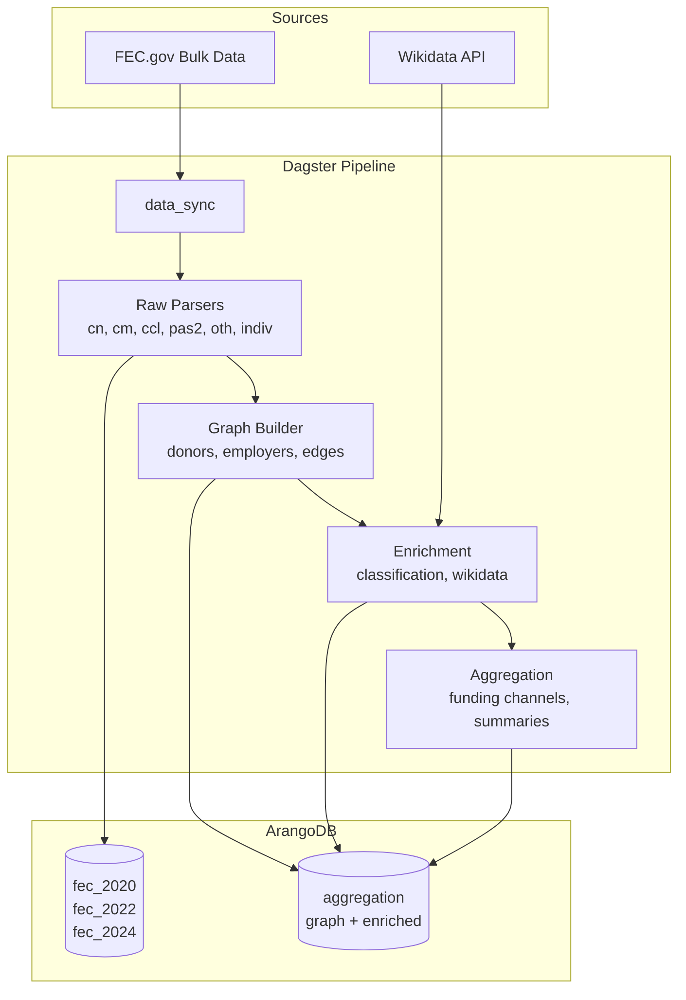
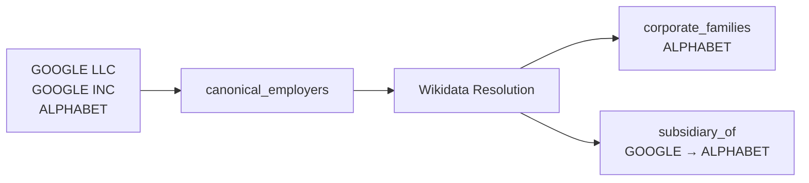

# Legal Tender

**Track political money from source to candidate.**

Legal Tender builds a graph database of political campaign finance, enabling queries like:

> *"Where did Elon Musk's money go, through how many PACs, to which candidates?"*

```
DONOR → PAC → PAC → PAC → CANDIDATE
  └─────────── trace the full path ───────────┘
```

## Quick Start

```bash
# Start all services
docker compose -f docker-compose.dev.yml up -d

# Access UIs
open http://localhost:4300    # Dagster (pipeline orchestration)
open http://localhost:4301    # ArangoDB (graph database) - root/ltpass
```

## Funding Channels

Every candidate's funding breaks down into **channels** — distinct ways money reaches or affects a candidate:

| Channel | Description |
|---------|-------------|
| **Organizational Direct** | Corporate, trade, labor, and ideological PAC money traced through passthroughs to terminal source |
| **IE Support** | Independent expenditures FOR the candidate, traced to who funded the Super PACs |
| **IE Oppose** | Independent expenditures AGAINST the candidate |
| **Individuals** | Whale donors (per-election max-out, with employer detail) + grassroots (below max-out, known totals) |
| **Unaccounted** | True residual — unitemized <$200, trace loss, data gaps. Typically 3-5% |

The system traces money **backwards** through any number of PAC transfers to find the **terminal source** — the entity that originally provided the funds.

## Architecture


```mermaid
flowchart TB
    subgraph Sources
        FEC[FEC.gov Bulk Data]
        WIKI[Wikidata API]
    end

    subgraph Dagster Pipeline
        SYNC[data_sync] --> RAW[Raw Parsers<br/>cn, cm, ccl, pas2, oth, indiv]
        RAW --> GRAPH[Graph Builder<br/>donors, employers, edges]
        GRAPH --> ENRICH[Enrichment<br/>classification, wikidata]
        ENRICH --> AGG[Aggregation<br/>funding channels, summaries]
    end

    subgraph ArangoDB
        FEC_DB[(fec_2020<br/>fec_2022<br/>fec_2024)]
        AGG_DB[(aggregation<br/>graph + enriched)]
    end

    FEC --> SYNC
    WIKI --> ENRICH
    RAW --> FEC_DB
    GRAPH --> AGG_DB
    ENRICH --> AGG_DB
    AGG --> AGG_DB
```

## Data Pipeline

### Jobs

| Job | Purpose | When to Use |
|-----|---------|-------------|
| `fec_pipeline_job` | Full refresh: download → parse → graph → enrich → aggregate | Weekly (scheduled) |
| `enrichment_job` | Run all enrichments (classification, Wikidata, clustering) | After graph changes |
| `aggregation_job` | Compute funding channels and summaries | After enrichment |
| `upstream_job` | Just refresh funding channels | Quick update |

### Run a Job

```bash
# Via Dagster UI
open http://localhost:4300
# Navigate to Jobs → Select job → Launch Run

# Via CLI
docker compose -f docker-compose.dev.yml exec dagster-webserver \
  dagster job execute -m src -j enrichment_job
```

## Database Schema

### ArangoDB Collections

**Vertices (Entities)**
| Collection | Count | Description |
|------------|-------|-------------|
| `candidates` | ~15K | Federal candidates |
| `committees` | ~30K | PACs, Super PACs, campaigns |
| `donors` | ~5M | Individual/organization donors |
| `employers` | ~500K | Employer names |
| `canonical_employers` | ~75K | Normalized employer groups |
| `corporate_families` | ~1K | Corporate hierarchies |

**Edges (Relationships)**
| Collection | Count | Description |
|------------|-------|-------------|
| `contributed_to` | ~5M | Donor → Committee |
| `transferred_to` | ~2M | Committee → Committee |
| `affiliated_with` | ~30K | Committee → Candidate |
| `employed_by` | ~5M | Donor → Employer |
| `spent_on` | ~200K | Independent expenditures |
| `subsidiary_of` | ~500 | Company → Parent |

### Graph Traversal

```aql
-- Trace money from donor to all candidates
FOR v, e, p IN 1..5 OUTBOUND "donors/MUSK_ELON"
    GRAPH "political_money_flow"
    FILTER IS_SAME_COLLECTION("candidates", v)
    RETURN {
        candidate: v.CAND_NAME,
        path_length: LENGTH(p.edges),
        via: p.vertices[1].CMTE_NM
    }
```

## Employer Resolution

The pipeline normalizes employer names and links them to corporate families:


```mermaid
flowchart LR
    RAW[GOOGLE LLC<br/>GOOGLE INC<br/>ALPHABET] --> NORM[canonical_employers]
    NORM --> WIKI[Wikidata Resolution]
    WIKI --> FAM[corporate_families<br/>ALPHABET]
    WIKI --> SUB[subsidiary_of<br/>GOOGLE → ALPHABET]
```

This enables queries like:
> "How much did **all Alphabet employees** give to Democrats?"

## Query CLI

```bash
# Show funding channels for a candidate
./query.sh --candidate "Ted Cruz" --funding

# By FEC ID
./query.sh --fec S2TX00312 --funding
```

## Documentation

- [Pipeline Details](docs/PIPELINE.md) - Full asset dependency graph and data flow
- [Pipeline Fixes](docs/PIPELINE_FIXES.md) - Data model decisions and fix tracker
- [FEC Data Reference](docs/FEC.md) - FEC bulk file schemas

## Development

```bash
# View logs
docker compose -f docker-compose.dev.yml logs -f dagster-webserver

# Check job status
docker compose -f docker-compose.dev.yml exec dagster-webserver python3 -c "
from dagster import DagsterInstance
instance = DagsterInstance.get()
for r in list(instance.get_runs(limit=5)):
    print(f'{r.run_id[:8]} | {r.job_name:20} | {r.status.name}')
"
```

## License

MIT
