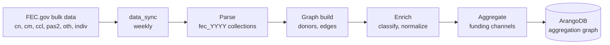

# Legal Tender

**Trace political money from source to candidate.**

Legal Tender builds a graph database of U.S. federal campaign finance and answers questions like:

> *"Who actually funded this candidate? Through how many PACs? How much came from corporate employees vs. individuals vs. independent expenditures vs. unitemized?"*

```
DONOR → PAC → PAC → PAC → CANDIDATE
  └─────────── trace the full path ───────────┘
```

The pipeline ingests FEC bulk data, builds a money-flow graph in ArangoDB, and computes per-candidate funding breakdowns via a multi-hop trace algorithm.

## What you get

For every federal candidate, per cycle and aggregated, a five-channel funding breakdown:

| Channel | Captures |
|---|---|
| **Organizational Direct** | Corporate, trade, labor, ideological, and cooperative PAC money — traced through any number of passthrough committees back to the terminal source organization. |
| **IE Support** | Independent expenditures FOR the candidate by Super PACs and others, traced upstream to who funded those Super PACs. |
| **IE Oppose** | Independent expenditures AGAINST the candidate (same trace). |
| **Individuals** | Itemized donations split into *whale* (per-election max-out donors, with employer/corporate detail) and *grassroots* (sub-limit, known totals from raw FEC). |
| **Unaccounted** | True residual: unitemized <$200 donors, deep trace loss, data gaps. Typically 3-5%. |

Each channel breaks down further by organization, so you can answer *"how much money traceable to Goldman Sachs reached this candidate, in what form?"* — corporate PAC, employee donations, IE support, or a combination.

## Architecture


```mermaid
flowchart LR
    FEC[FEC.gov bulk data<br/>cn, cm, ccl, pas2, oth, indiv] --> SYNC[data_sync<br/>weekly]
    SYNC --> PARSE[Parse<br/>fec_YYYY collections]
    PARSE --> GRAPH[Graph build<br/>donors, edges]
    GRAPH --> ENRICH[Enrich<br/>classify, normalize]
    ENRICH --> AGG[Aggregate<br/>funding channels]
    AGG --> ARANGO[(ArangoDB<br/>aggregation graph)]
```

Five-layer Dagster pipeline (sync → parse → graph → enrich → aggregate). Each layer is a group of assets; full asset-level detail in [`docs/pipeline.md`](docs/pipeline.md). Storage layout in [`docs/storage.md`](docs/storage.md).

## Run

```bash
docker compose -f docker-compose.dev.yml up -d
```

- Dagster UI: http://localhost:4300
- ArangoDB UI: http://localhost:4301 (root / ltpass)

To trigger the full pipeline manually, use the Dagster UI or the CLI inside the webserver container:

```bash
docker exec legal-tender-dev-webserver dagster asset materialize \
  --select 'group:fec' -f /workspace/src/__init__.py
```

A complete cold-start sync + parse takes ~60-90 minutes for 4 cycles of FEC data (~17GB raw, ~215M individual contribution records).

## Data scale

Per the most recent full sync (May 2026):

| Cycle | Candidates | Committees | Individual contributions |
|---|---|---|---|
| 2020 | 7,758 | 18,286 | 69.4M |
| 2022 | 8,580 | 19,794 | 63.9M |
| 2024 | 9,804 | 20,941 | 58.2M |
| 2026 | 7,877 | 19,542 | 23.6M (Q1 only — actively growing) |

Live counts in the ArangoDB UI; current as-of values in the funding-channels output computed by `candidate_funding`.

## Stack

- **Orchestration**: [Dagster](https://dagster.io/) — assets, dependency graph, schedules
- **Storage**: [ArangoDB](https://arangodb.com/) — multi-model database with named-graph support, used for both raw FEC collections and the aggregated political money graph
- **External LLMs** (optional, for employer/corporate normalization via [Wikidata](https://www.wikidata.org/)): Qwen-3.5-35B + Qwen-3-Embedding-8B served from a local node over Tailscale via OpenAI-compatible endpoints

## Repository layout

```
legal-tender/
  AGENTS.md                  Agent context (if you're an LLM, start here)
  CLAUDE.md → AGENTS.md      Symlink for Claude Code compatibility
  README.md                  This file (human-facing)
  docker-compose.{dev,yml}.yml
  Dockerfile{,.dev}
  src/
    assets/                  Dagster assets, grouped by layer
      sync/  fec/  graph/  enrichment/  aggregation/  mapping/
    api/                     External API clients (Congress, FEC, Lobbying)
    rag/                     Wikidata client + employer normalization
    resources/               Dagster resources (ArangoDB, embedding)
    utils/                   Storage paths, FEC schema loader, dump manager
    cli/                     CLI utilities
    models/                  Vertex + edge schema definitions
    jobs/  schedules/        Dagster job + schedule definitions
  docs/
    architecture.md          High-level system view
    pipeline.md              Per-asset pipeline detail
    funding-channels.md      The 5-channel model + trace algorithm
    fec-data.md              FEC bulk-file reference
    storage.md               Storage layout (~/workspace/data/legal-tender/)
    operations.md            Runbook for common ops
    decisions.md             Historical decision log
    second-brain.md          Self-hosted second-brain stack design
    todo.md                  Active TODOs, open issues
    setup-currency.md        Meta-tooling currency audit
    plan.md                  Master plan for the in-progress professionalization effort
    audit/                   Phase 0 audit deliverables
```

## Status

Active development. Currently on `feature/professionalization` branch — a structured cleanup pushing the project toward production-readiness. See [`docs/plan.md`](docs/plan.md) for the phased plan; current state in [`docs/todo.md`](docs/todo.md).

## License

MIT — see `LICENSE` (TODO: add file).
