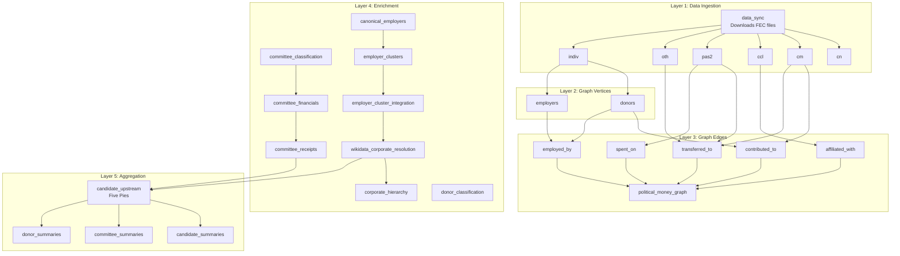
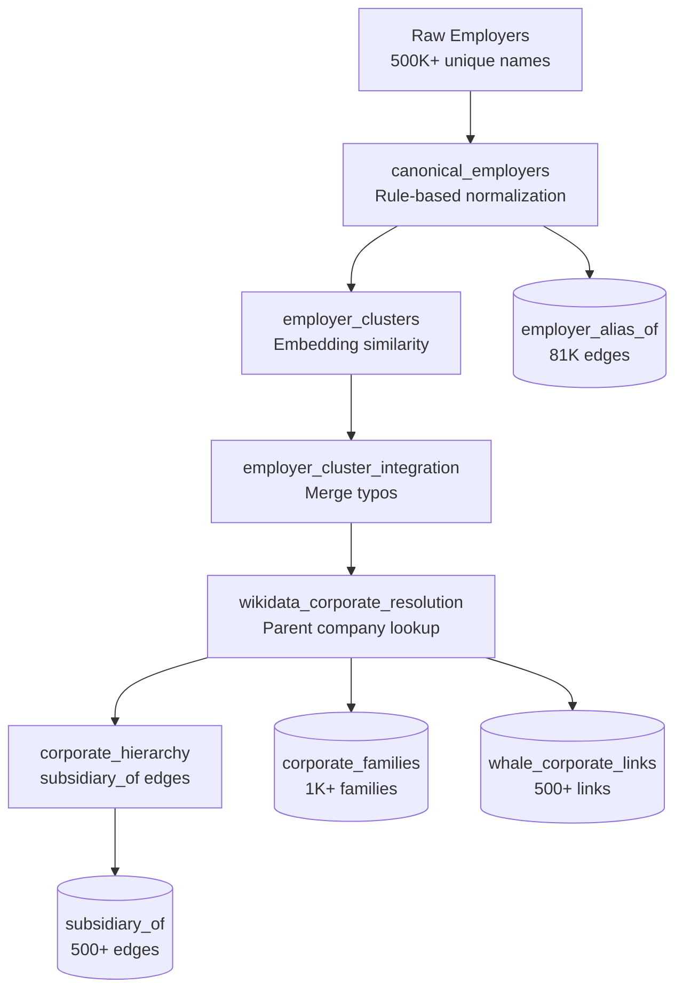

# Legal Tender Pipeline

Complete technical documentation for the Dagster data pipeline.

---

## Mission Statement

**Legal Tender traces every dollar to its corporate origin.**

For any federal candidate, we answer: **Who is really funding them?**

The answer isn't just "they got $5M from PACs" - we trace through Joint Fundraising Committees, passthrough vehicles, and individual donors to find the **terminal sources**:

| Source Type | What We Track |
|-------------|---------------|
| **Corporations** | PAC donations traced to parent company (Goldman Sachs PAC → Goldman Sachs) |
| **Individuals** | Employee donations rolled up to employer (John Smith @ Google → Google) |
| **IE Spending** | Super PAC money traced back to corporate funders (FF PAC → Moskovitz → Asana) |
| **Lobbying** | *(Not yet implemented)* Direct lobbying spend per congressperson |

### The Five Pies

For each candidate, per election cycle:

1. **Direct PAC** - Corporate/Trade/Union PAC contributions
2. **Employee Donations** - Individual donations rolled up by employer
3. **IE Support** - Independent expenditures FOR the candidate, traced to funders
4. **IE Oppose** - Independent expenditures AGAINST, traced to funders  
5. **Lobbying** - *(Future)* Lobbying spend on that congressperson

Each pie is broken down **by organization** - so you can see:
- "Asana gave Harris $20.8M total: $0 direct, $121K employees, $20.7M IE support"

### Data Quality

We handle the messy reality of FEC data:
- **Employer typos**: "GOOGL INC" → "GOOGLE" via embedding clustering
- **Corporate hierarchy**: YouTube employees → Google → Alphabet
- **Whale donors**: Billionaires linked to their companies via Wikidata
- **Passthrough tracing**: JFC money traced proportionally to original sources

---

## Pipeline Overview



## Asset Reference

### Layer 1: Data Ingestion

| Asset | Source | Target | Description |
|-------|--------|--------|-------------|
| `data_sync` | FEC.gov | `data/fec/` | Downloads all FEC bulk files |
| `cn` | cn.zip | `fec_YYYY.cn` | Candidate master records |
| `cm` | cm.zip | `fec_YYYY.cm` | Committee master records |
| `ccl` | ccl.zip | `fec_YYYY.ccl` | Candidate-committee linkages |
| `pas2` | pas2.zip | `fec_YYYY.pas2` | PAC contributions to candidates |
| `oth` | oth.zip | `fec_YYYY.oth` | Committee-to-committee transfers |
| `indiv` | indiv.zip | `fec_YYYY.indiv` | Individual contributions (~69M/cycle) |

### Layer 2: Graph Vertices

| Asset | Source | Target | Description |
|-------|--------|--------|-------------|
| `donors` | `fec_YYYY.indiv` | `aggregation.donors` | Aggregated donors (by name+employer+zip) |
| `employers` | `fec_YYYY.indiv` | `aggregation.employers` | Unique employer names |

### Layer 3: Graph Edges

| Asset | Source | Target | Description |
|-------|--------|--------|-------------|
| `contributed_to` | indiv + cm | `aggregation.contributed_to` | Donor → Committee donations |
| `transferred_to` | pas2 + oth + cm | `aggregation.transferred_to` | Committee → Committee transfers |
| `affiliated_with` | ccl | `aggregation.affiliated_with` | Committee → Candidate links |
| `employed_by` | donors + employers | `aggregation.employed_by` | Donor → Employer |
| `spent_on` | pas2 | `aggregation.spent_on` | Independent expenditures |
| `political_money_graph` | all edges | `aggregation.political_money_flow` | Named graph definition |

### Layer 4: Enrichment

| Asset | Dependencies | Target | Description |
|-------|--------------|--------|-------------|
| `committee_classification` | contributed_to | committees.terminal_type | Classifies committees (corporation, labor_union, etc.) |
| `committee_financials` | contributed_to, transferred_to, committee_classification | committees.total_receipts | Computes receipt totals from edges |
| `committee_receipts` | indiv, pas2, oth, committee_financials | committees.* | Full receipt breakdown from raw FEC |
| `donor_classification` | donors | donors.whale_tier | Classifies donors (ultra, mega, whale, notable) |
| `canonical_employers` | employers | canonical_employers | Groups employer name variations |
| `employer_clusters` | canonical_employers | employer_clusters | Embedding-based typo detection |
| `employer_cluster_integration` | employer_clusters | employer_alias_of | Merges clusters into canonical |
| `wikidata_corporate_resolution` | canonical_employers, donors | corporate_families, whale_corporate_links | Resolves parent companies via Wikidata |
| `corporate_hierarchy` | employer_cluster_integration, wikidata_corporate_resolution | subsidiary_of | Builds parent-child edges |

### Layer 5: Aggregation

| Asset | Dependencies | Target | Description |
|-------|--------------|--------|-------------|
| `candidate_upstream` | committee_receipts, wikidata_corporate_resolution | candidates.funding_sources | The "Five Pies" - traces all funding to terminal sources |
| `candidate_summaries` | candidate_upstream | candidates.summary | Pre-computed stats for UI |
| `committee_summaries` | candidate_upstream | committees.summary | Pre-computed stats for UI |
| `donor_summaries` | candidate_upstream | donors.summary | Pre-computed stats for UI |

---

## Jobs

### fec_pipeline_job
**Full refresh** - Downloads FEC data and rebuilds everything.
```bash
dagster job execute -m src -j fec_pipeline_job
```

### enrichment_job
**Enrichment only** - Classification, Wikidata resolution, clustering.
```bash
dagster job execute -m src -j enrichment_job
```

Assets included:
- committee_classification
- committee_financials
- committee_receipts
- donor_classification
- canonical_employers
- employer_clusters
- employer_cluster_integration
- wikidata_corporate_resolution
- corporate_hierarchy

### aggregation_job
**Summaries only** - Computes Five Pies and pre-aggregated stats.
```bash
dagster job execute -m src -j aggregation_job
```

Assets included:
- candidate_upstream
- candidate_summaries
- committee_summaries
- donor_summaries

### upstream_job
**Quick Five Pies refresh** - Just candidate funding sources.
```bash
dagster job execute -m src -j upstream_job
```

---

## The Five Pies Algorithm

The `candidate_upstream` asset computes where a candidate's money **actually** comes from by tracing backwards through the graph.

### Terminal Types

Money flow stops at these committee types (they are the **origin**):

| Terminal Type | Description | Example |
|---------------|-------------|---------|
| `corporation` | Corporate PAC | "GOLDMAN SACHS GROUP INC PAC" |
| `trade_association` | Industry group | "AMERICAN BANKERS ASSOCIATION PAC" |
| `labor_union` | Union PAC | "UNITED AUTO WORKERS" |
| `ideological` | Issue-based PAC | "EMILY'S LIST" |
| `cooperative` | Member cooperative | "LAND O'LAKES INC PAC" |

### Passthrough Types

Money flow continues through these (they are **conduits**):

| Passthrough Type | Description | Example |
|------------------|-------------|---------|
| `passthrough` | Joint fundraising committees | "TRUMP VICTORY" |
| `super_pac_unclassified` | IE-only committees | Various Super PACs |
| `campaign` | Candidate committees | "CRUZ FOR SENATE" |

### Algorithm

```python
def trace_upstream(candidate):
    # Start with committees affiliated with candidate
    committees = get_affiliated_committees(candidate)
    
    while committees:
        for cmte in committees:
            if cmte.terminal_type in TERMINAL_TYPES:
                # Found origin - attribute money
                attribute_to_source(cmte)
            else:
                # Passthrough - trace further upstream
                upstream = get_transfers_to(cmte)
                committees.extend(upstream)
    
    # Also attribute direct individual contributions
    for donor in get_donors_to_candidate_committees(candidate):
        if donor.employer in corporate_families:
            attribute_to_corporation(donor)
        else:
            attribute_to_individuals(donor)
```

### Output

Each candidate gets a `funding_sources` field:

```json
{
  "funding_sources": {
    "total": 5000000,
    "corporations": {
      "total": 1750000,
      "pct": 35.0,
      "top_sources": [
        {"name": "GOLDMAN SACHS", "amount": 250000},
        {"name": "JPMORGAN CHASE", "amount": 180000}
      ]
    },
    "trade_associations": {"total": 1000000, "pct": 20.0, ...},
    "labor_unions": {"total": 750000, "pct": 15.0, ...},
    "ideological": {"total": 500000, "pct": 10.0, ...},
    "individuals": {
      "total": 1000000,
      "pct": 20.0,
      "corporate_connected": 600000,
      "independent": 400000
    }
  }
}
```

---

## Employer Resolution Pipeline

### Why It Matters

FEC data has employer names entered by donors - full of variations:

```
GOOGLE LLC
GOOGLE INC
GOOGLE, INC.
ALPHABET INC
YOUTUBE LLC
```

Without normalization, we can't answer: "How much did Google employees give?"

### Resolution Steps



### 1. canonical_employers

Groups name variations using rule-based normalization:
- Remove legal suffixes (LLC, Inc, Corp)
- Standardize abbreviations (INTL → INTERNATIONAL)
- Upper-case normalization

**Output**: 75K canonical employers from 500K raw names

### 2. employer_clusters

Uses embedding similarity to find typos:
- Computes embeddings for employer names
- Clusters by cosine similarity (>0.97 = typo)

**Output**: Typo clusters for manual review

### 3. wikidata_corporate_resolution

Queries Wikidata SPARQL for:
- Company → Parent company (Google → Alphabet)
- Person → Companies founded/led (Elon Musk → Tesla, SpaceX)

**Output**: 
- `corporate_families` - Canonical companies with total influence
- `whale_corporate_links` - Billionaire → Company associations

### 4. corporate_hierarchy

Builds graph edges for subsidiary relationships:

```aql
FOR v IN 1..3 INBOUND "corporate_parents/ALPHABET"
    GRAPH "corporate_ownership"
    RETURN v.name
-- Returns: GOOGLE, YOUTUBE, WAYMO, DEEPMIND, etc.
```

---

## ArangoDB Schema

### Databases

| Database | Purpose |
|----------|---------|
| `fec_2020` | Raw FEC data for 2020 cycle |
| `fec_2022` | Raw FEC data for 2022 cycle |
| `fec_2024` | Raw FEC data for 2024 cycle |
| `aggregation` | Graph database with enriched data |

### aggregation Collections

**Vertex Collections**
```
candidates          - Federal candidates
committees          - PACs, Super PACs, campaigns
donors              - Individual/org donors
employers           - Raw employer names
canonical_employers - Normalized employer groups
corporate_families  - Company groups with totals
corporate_parents   - Parent company records
```

**Edge Collections**
```
contributed_to      - Donor → Committee
transferred_to      - Committee → Committee  
affiliated_with     - Committee → Candidate
employed_by         - Donor → Employer
spent_on            - Committee → Candidate (IEs)
employer_alias_of   - Employer → Canonical
subsidiary_of       - Company → Parent
whale_corporate_links - Person → Company
```

**Graph**
```
political_money_flow - Main traversal graph
```

---

## Directory Structure

```
src/
├── __init__.py              # Dagster Definitions
├── assets/
│   ├── sync/               # data_sync
│   ├── fec/                # cn, cm, ccl, pas2, oth, indiv
│   ├── graph/              # donors, employers, edges
│   ├── enrichment/         # classification, wikidata, clustering
│   └── aggregation/        # Five Pies, summaries
├── jobs/                   # Job definitions
├── resources/              # ArangoDB, Embedding service
├── schedules/              # Weekly schedule
├── rag/                    # Utility libraries (NOT RAG AI)
│   ├── employer_normalization.py
│   └── wikidata_client.py
└── cli/                    # Query tools
```

### Note on `src/rag/`

Despite the name, this is **not** Retrieval-Augmented Generation. It's utility code:
- `employer_normalization.py` - Rule-based name cleaning
- `wikidata_client.py` - SPARQL queries to Wikidata

The name is historical ("Resolution And Grouping").

---

## Operations

### Check Job Status

```bash
docker compose -f docker-compose.dev.yml exec dagster-webserver python3 -c "
from dagster import DagsterInstance
instance = DagsterInstance.get()
for r in list(instance.get_runs(limit=5)):
    print(f'{r.run_id[:8]} | {r.job_name:20} | {r.status.name}')
"
```

### View Asset Dependencies

Open Dagster UI at http://localhost:4300 → Assets → Global Asset Lineage

### Cancel a Run

```bash
docker compose -f docker-compose.dev.yml exec dagster-webserver python3 -c "
from dagster import DagsterInstance
instance = DagsterInstance.get()
run = list(instance.get_runs(limit=1))[0]
instance.report_run_canceled(run)
print(f'Cancelled {run.run_id[:8]}')
"
```

### Query ArangoDB

```bash
# Via arangosh
docker compose -f docker-compose.dev.yml exec arangodb arangosh \
  --server.username root --server.password ltpass

# Example query
db._useDatabase("aggregation")
db._query(`
  FOR c IN candidates
  FILTER c.funding_sources.total > 1000000
  SORT c.funding_sources.total DESC
  LIMIT 10
  RETURN {name: c.CAND_NAME, total: c.funding_sources.total}
`).toArray()
```
