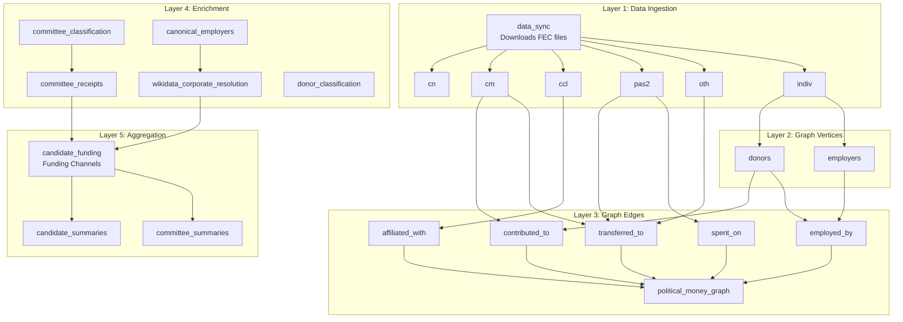
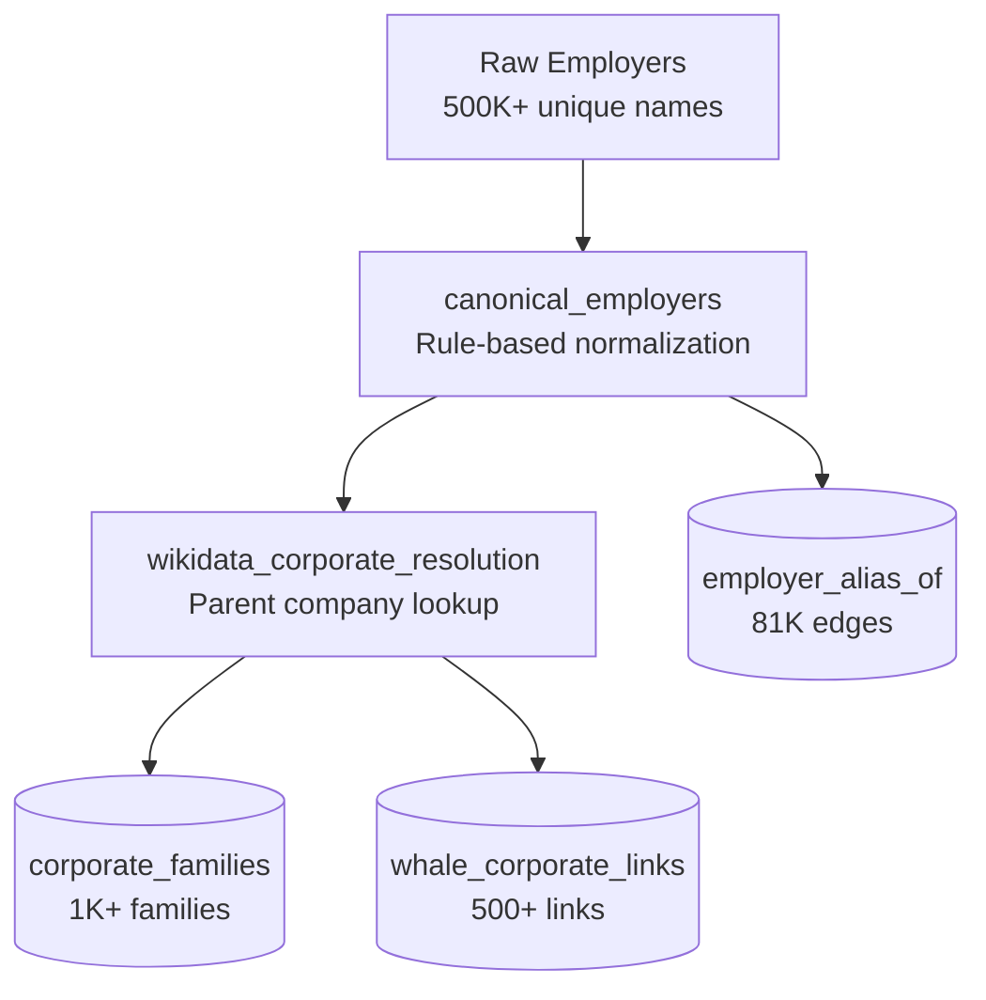

# Legal Tender Pipeline

Complete technical documentation for the Dagster data pipeline.

---

## Mission Statement

**Legal Tender traces every dollar to its origin.**

For any federal candidate, we answer: **Who is really funding them?**

The answer isn't just "they got $5M from PACs" — we trace backwards through Joint Fundraising Committees, passthrough vehicles, and individual donors to find the **terminal sources**, then organize everything into funding channels.

### Funding Channels

For each candidate, per election cycle:

| Channel | What It Captures |
|---------|-----------------|
| **Ch1: Organizational Direct** | PAC money traced through passthrough committees to terminal orgs (corp, trade, labor, ideological, cooperative) |
| **Ch2: IE Support** | Independent expenditures FOR the candidate by Super PACs, traced to who funded those PACs |
| **Ch3: IE Oppose** | Independent expenditures AGAINST the candidate (same trace methodology) |
| **Ch4: Individuals** | People giving directly to candidate's committees ($200+ itemized), split by corporate connection |
| **Ch5: Unaccounted** | Gap between committee receipts and traced inflows — mostly unitemized small donors (<$200) |

Each channel is broken down **by organization** — so you can see:
- "Goldman Sachs: $50K direct PAC, $120K from employees, $2M IE support"

### Data Quality

We handle the messy reality of FEC data:
- **Employer normalization**: "GOOGL INC" → "GOOGLE" via canonical mapping
- **Whale donors**: Billionaires linked to their companies via Wikidata SPARQL
- **Passthrough tracing**: JFC money traced proportionally to original sources
- **Conduit filtering**: ActBlue/WinRed stripped to avoid double-counting earmarked donations

---

## Pipeline Overview



## Asset Reference

### Layer 1: Data Ingestion

| Asset | Source | Target | Description |
|-------|--------|--------|-------------|
| `data_sync` | FEC.gov | `data/fec/` | Downloads all FEC bulk files |
| `cn` | cn.zip | `fec_YYYY.cn` | Candidate master records |
| `cm` | cm.zip | `fec_YYYY.cm` | Committee master records |
| `ccl` | ccl.zip | `fec_YYYY.ccl` | Candidate-committee linkages |
| `pas2` | pas2.zip | `fec_YYYY.pas2` | PAC contributions to candidates |
| `oth` | oth.zip | `fec_YYYY.oth` | Committee-to-committee transfers |
| `indiv` | indiv.zip | `fec_YYYY.indiv` | Individual contributions (~69M/cycle) |

### Layer 2: Graph Vertices

| Asset | Source | Target | Description |
|-------|--------|--------|-------------|
| `donors` | `fec_YYYY.indiv` | `aggregation.donors` | Aggregated donors (ENTITY_TP IN ['IND','CAN'], by name+employer+zip) |
| `employers` | `fec_YYYY.indiv` | `aggregation.employers` | Unique employer names |

### Layer 3: Graph Edges

| Asset | Source | Target | Description |
|-------|--------|--------|-------------|
| `contributed_to` | indiv + cm | `aggregation.contributed_to` | Donor → Committee donations (IND+CAN only) |
| `transferred_to` | pas2 + oth + cm | `aggregation.transferred_to` | Committee → Committee transfers |
| `affiliated_with` | ccl | `aggregation.affiliated_with` | Committee → Candidate links |
| `employed_by` | donors + employers | `aggregation.employed_by` | Donor → Employer |
| `spent_on` | pas2 | `aggregation.spent_on` | Independent expenditures (support/oppose) |
| `political_money_graph` | all edges | `aggregation.political_money_flow` | Named graph definition |

### Layer 4: Enrichment

| Asset | Dependencies | Target | Description |
|-------|--------------|--------|-------------|
| `committee_classification` | contributed_to | committees.terminal_type | Classifies committees (corporation, labor_union, trade, ideological, cooperative, passthrough, campaign, etc.) |
| `committee_receipts` | indiv, pas2, oth, contributed_to | committees.total_receipts | Computes receipt totals from raw FEC data (individuals + transfers) |
| `donor_classification` | donors | donors.whale_tier | Classifies donors by giving level (ultra, mega, whale, notable) |
| `canonical_employers` | employers | canonical_employers | Groups employer name variations via rule-based normalization |
| `wikidata_corporate_resolution` | canonical_employers, donors | corporate_families, whale_corporate_links | Resolves parent companies and billionaire-company links via Wikidata SPARQL |

### Layer 5: Aggregation

| Asset | Dependencies | Target | Description |
|-------|--------------|--------|-------------|
| `candidate_funding` | committee_receipts, wikidata_corporate_resolution, committee_classification, all edges | candidates.funding_channels | Traces all funding to terminal sources, organized by funding channel |
| `candidate_summaries` | candidate_funding, committee_receipts | candidates.summary | Pre-computed stats for UI |
| `committee_summaries` | candidate_funding, committee_receipts | committees.summary | Pre-computed stats for UI |

---

## Jobs

### enrichment_job
**Enrichment only** — Classification, Wikidata resolution, receipt computation.
```bash
dagster job execute -m src -j enrichment_job
```

Assets: committee_classification, committee_receipts, donor_classification, canonical_employers, wikidata_corporate_resolution

### aggregation_job
**Summaries only** — Computes funding channels and pre-aggregated stats.
```bash
dagster job execute -m src -j aggregation_job
```

Assets: candidate_funding, candidate_summaries, committee_summaries

### upstream_job
**Quick funding refresh** — Just candidate funding channels.
```bash
dagster job execute -m src -j upstream_job
```

Assets: candidate_funding

---

## The Funding Channels Algorithm

The `candidate_funding` asset computes where a candidate's money **actually** comes from by tracing backwards through the committee graph.

### Terminal Types

Money flow stops at these committee types (they are the **origin**):

| Terminal Type | Count | Description | Example |
|---------------|-------|-------------|---------|
| `corporation` | 2,048 | Corporate PAC | "GOLDMAN SACHS GROUP INC PAC" |
| `trade_association` | 786 | Industry group | "AMERICAN BANKERS ASSOCIATION PAC" |
| `labor_union` | 387 | Union PAC | "UNITED AUTO WORKERS" |
| `ideological` | 399 | Issue-based PAC | "EMILY'S LIST" |
| `cooperative` | 54 | Member cooperative | "LAND O'LAKES INC PAC" |

### Passthrough Types

Money flow continues through these (they are **conduits**):

| Passthrough Type | Count | Description | Example |
|------------------|-------|-------------|---------|
| `passthrough` | 8,139 | Joint fundraising committees, party committees | "TRUMP VICTORY" |
| `super_pac_unclassified` | 4,533 | IE-only committees with no ORG_TP | Various Super PACs |
| `campaign` | 13,493 | Candidate committees | "CRUZ FOR SENATE" |
| `unknown` | 994 | No classification data | — |

### BFS Tracing Algorithm

```
For each candidate:
  1. Get UNIQUE affiliated committee IDs (deduplicated across cycles)
  2. BFS backwards from those committees:
     - Individual contributions → Channel 4 (Individuals)
     - Transfers from terminal orgs → Channel 1 (Org Direct)
     - Transfers from passthroughs → keep tracing with proportional multiplier
       multiplier = parent_mult × (transfer_amount / from_committee_receipts)
  3. IE spending on candidate → Channels 2/3 (Support/Oppose)
     - For each Super PAC, trace its funding upstream similarly
  4. Unaccounted = committee_total_receipts - traced_total
```

The proportional multiplier ensures that if a JFC raised $100M and sent $1M to this candidate, we only attribute 1% of each upstream source to this candidate.

### Output Structure

Each candidate gets a `funding_channels` field:

```json
{
  "funding_channels": {
    "by_cycle": { "2020": {...}, "2022": {...}, "2024": {...} },
    "aggregate": {
      "total_funding": 26290182,
      "direct_funding": 17556160,
      "ie_support": 8734022,
      "ie_oppose": 2884844,
      "organizational_direct": {
        "total": 1263419, "pct": 4.8,
        "by_type": {
          "corporation": { "total": 445037, "top": [...] },
          "trade_association": { "total": 497658, "top": [...] },
          "labor_union": { "total": 87705, "top": [...] },
          "ideological": { "total": 227051, "top": [...] },
          "cooperative": { "total": 5968, "top": [...] }
        }
      },
      "ie": {
        "support": { "total": 8734022, "top_pacs": [...], "by_corporation": [...] },
        "oppose": { "total": 2884844, "top_pacs": [...], "by_corporation": [...] }
      },
      "individuals": {
        "total": 16292742, "pct": 62.0,
        "corporate_connected": { "total": 596644, "by_company": [...] },
        "independent": { "total": 15696098, "top": [...] }
      },
      "unaccounted": {
        "total": 54337073, "pct": 75.6,
        "cmte_total_receipts": 71893233,
        "traced_total": 17556160,
        "breakdown": {
          "small_donor_estimate": 43472575,
          "from_individuals": 59575814,
          "from_committees": 12317419
        }
      },
      "by_organization": [
        { "name": "...", "direct_pac": 0, "direct_employees": 0, "ie_support": 0, "ie_oppose": 0, "total_pro": 0 }
      ]
    },
    "cycles_available": ["2020", "2022", "2024"],
    "computed_at": "2026-02-07T..."
  }
}
```

### Validation Results (Feb 7, 2026)

| | **Harris (Pres)** | **Trump** | **Cruz (Senate)** |
|---|---|---|---|
| **Total Traced** | $804M | $457M | $26.3M |
| **Ch1 Org Direct** | $2.0M (0.2%) | $834K (0.2%) | $1.26M (4.8%) |
| **Ch2 IE Support** | $548M (68.2%) | $300M (65.8%) | $8.7M (33.2%) |
| **Ch3 IE Oppose** | $561M | $492M | $2.9M |
| **Ch4 Individuals** | $254M (31.6%) | $155M (34.0%) | $16.3M (62.0%) |
| **Ch5 Unaccounted** | $1.54B (85.8%) | $828M (84.1%) | $54M (75.6%) |
| — Small donors est. | $729M | $205M | $43.5M |

---

## Employer Resolution Pipeline

### Why It Matters

FEC data has employer names entered by donors — full of variations:

```
GOOGLE LLC
GOOGLE INC
GOOGLE, INC.
ALPHABET INC
```

Without normalization, we can't answer: "How much did Google employees give?"

### Resolution Steps



### 1. canonical_employers

Groups name variations using rule-based normalization:
- Remove legal suffixes (LLC, Inc, Corp)
- Standardize abbreviations (INTL → INTERNATIONAL)
- Upper-case normalization

**Output**: 75K canonical employers from 500K raw names

### 2. wikidata_corporate_resolution

Queries Wikidata SPARQL for:
- Company → Parent company (Google → Alphabet)
- Person → Companies founded/led (Elon Musk → Tesla, SpaceX)

**Output**: 
- `corporate_families` — Canonical companies with total influence
- `whale_corporate_links` — Billionaire → Company associations

---

## ArangoDB Schema

### Databases

| Database | Purpose |
|----------|---------|
| `fec_2020` | Raw FEC data for 2020 cycle |
| `fec_2022` | Raw FEC data for 2022 cycle |
| `fec_2024` | Raw FEC data for 2024 cycle |
| `aggregation` | Graph database with enriched data |

### aggregation Collections

**Vertex Collections**
```
candidates          - Federal candidates (11,796)
committees          - PACs, Super PACs, campaigns (30,840 classified)
donors              - Individual donors, ENTITY_TP IN ['IND','CAN'] (280,513)
employers           - Raw employer names
canonical_employers - Normalized employer groups
corporate_families  - Company groups with totals
```

**Edge Collections**
```
contributed_to      - Donor → Committee (3,327,970 edges)
transferred_to      - Committee → Committee (654,530 edges)
affiliated_with     - Committee → Candidate (22,808 edges, per-cycle)
employed_by         - Donor → Employer (147,810 edges)
spent_on            - Committee → Candidate IEs (20,373 edges)
employer_alias_of   - Employer → Canonical
whale_corporate_links - Person → Company
```

**Graph**
```
political_money_flow - Main traversal graph
```

---

## Directory Structure

```
src/
├── __init__.py              # Dagster Definitions
├── assets/
│   ├── sync/               # data_sync
│   ├── fec/                # cn, cm, ccl, pas2, oth, indiv
│   ├── graph/              # donors, employers, edges
│   ├── enrichment/         # classification, wikidata, receipts
│   └── aggregation/        # candidate_funding, summaries
├── jobs/                   # Job definitions
├── resources/              # ArangoDB resource
├── utils/                  # Memory tracking, preflight checks
└── api/                    # Congress API, election API, lobbying API
```

---

## Operations

### Materialize a Single Asset

```bash
docker compose -f docker-compose.dev.yml exec dagster-webserver \
  dagster asset materialize --select <asset_name> -m src
```

### Check Job Status

```bash
docker compose -f docker-compose.dev.yml exec dagster-webserver python3 -c "
from dagster import DagsterInstance
instance = DagsterInstance.get()
for r in list(instance.get_runs(limit=5)):
    print(f'{r.run_id[:8]} | {r.job_name:20} | {r.status.name}')
"
```

### View Asset Dependencies

Open Dagster UI at http://localhost:4300 → Assets → Global Asset Lineage

### Query ArangoDB

```bash
docker compose -f docker-compose.dev.yml exec dagster-webserver python3 << 'EOF'
from arango import ArangoClient
client = ArangoClient(hosts='http://legal-tender-dev-arango:8529')
db = client.db('aggregation', username='root', password='ltpass')

for doc in db.aql.execute("""
    FOR c IN candidates
        FILTER c.funding_channels.total_funding > 1000000
        SORT c.funding_channels.total_funding DESC
        LIMIT 10
        RETURN { name: c.CAND_NAME, total: c.funding_channels.total_funding }
"""):
    print(f"{doc['name']:40} ${doc['total']:>15,.0f}")
EOF
```
